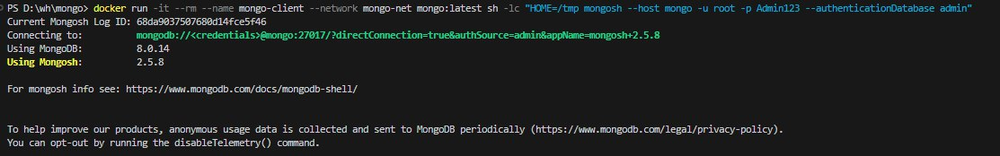
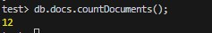

# ДЗ 1

ФИО: Демухаметов Павел

## Окружение
- Windows 11 + Docker
- Образ: mongo:5.0.4

## Развёртывание в docker

### Создание сети
~~~powershell
docker network create mongo-net
~~~

### Развёртывание
~~~powershell
docker run -d `
  --name mongo `
  --network mongo-net `
  --restart unless-stopped `
  -v "D:/mongo:/data/db" `
  -e MONGO_INITDB_ROOT_USERNAME=root `
  -e MONGO_INITDB_ROOT_PASSWORD=Admin123 `
  mongo:5.0.4
~~~

### Просмотр контейнеров
~~~powershell
docker ps
~~~

## Подключение
~~~powershell
docker run -it --rm --name mongo-client --network mongo-net mongo:5.0.4 sh -lc "HOME=/tmp mongosh --host mongo -u root -p Admin123 --authenticationDatabase admin"
~~~

## Создание коллекции со случайным количеством элементов 
~~~javascript
use test
for (let i = 0; i < Math.floor(Math.random() * 100) + 1; i++) {
  db.docs.insertOne({ key: i, random_point: [Math.random(), Math.random()] });
}
~~~

## Просмотр количества элементов
~~~javascript
    db.docs.countDocuments();
~~~

## Просмотр документов
~~~javascript
test> db.docs.find().toArray()
[
  {
    _id: ObjectId("68d98e309ff5b1c7d89933dc"),
    key: 0,
    random_point: [ 0.8942166308051567, 0.23472273630233031 ]
  },
  {
    _id: ObjectId("68d98e319ff5b1c7d89933dd"),
    key: 1,
    random_point: [ 0.09997895711767679, 0.9614896242257001 ]
  },
  {
    _id: ObjectId("68d98e319ff5b1c7d89933de"),
    key: 2,
    random_point: [ 0.4237863585995314, 0.6632227882402169 ]
  },
  {
    _id: ObjectId("68d98e319ff5b1c7d89933df"),
    key: 3,
    random_point: [ 0.8067620988742041, 0.5989019645820945 ]
  },
  {
    _id: ObjectId("68d98e319ff5b1c7d89933e0"),
    key: 4,
    random_point: [ 0.8692141318689981, 0.3247349656826617 ]
  },
  {
    _id: ObjectId("68d98e319ff5b1c7d89933e1"),
    key: 5,
    random_point: [ 0.9139372013235467, 0.43729208035793454 ]
  },
  {
    _id: ObjectId("68d98e319ff5b1c7d89933e2"),
    key: 6,
    random_point: [ 0.9573190667030782, 0.29721871125603383 ]
  },
  {
    _id: ObjectId("68d98e319ff5b1c7d89933e3"),
    key: 7,
    random_point: [ 0.05925250643096991, 0.5993209899504712 ]
  },
  {
    _id: ObjectId("68d98e319ff5b1c7d89933e4"),
    key: 8,
    random_point: [ 0.5702903255035785, 0.9373477148959986 ]
  },
  {
    _id: ObjectId("68d98e319ff5b1c7d89933e5"),
    key: 9,
    random_point: [ 0.6842683176576916, 0.29855752578404937 ]
  },
  {
    _id: ObjectId("68d98e319ff5b1c7d89933e6"),
    key: 10,
    random_point: [ 0.2410083658881894, 0.5680904880986308 ]
  },
  {
    _id: ObjectId("68d98e319ff5b1c7d89933e7"),
    key: 11,
    random_point: [ 0.4656326404180178, 0.2918996115080168 ]
  },
  {
    _id: ObjectId("68d98e319ff5b1c7d89933e8"),
    key: 12,
    random_point: [ 0.8049994038194279, 0.03558673895804754 ]
  },
  {
    _id: ObjectId("68d98e319ff5b1c7d89933e9"),
    key: 13,
    random_point: [ 0.9089552866139103, 0.2407697003716922 ]
  },
  {
    _id: ObjectId("68d98e319ff5b1c7d89933ea"),
    key: 14,
    random_point: [ 0.6338417984179474, 0.8195737069066928 ]
  },
  {
    _id: ObjectId("68d98e319ff5b1c7d89933eb"),
    key: 15,
    random_point: [ 0.4080197858838197, 0.914457105989428 ]
  },
  {
    _id: ObjectId("68d98e319ff5b1c7d89933ec"),
    key: 16,
    random_point: [ 0.4108142481541026, 0.7270395607927251 ]
  },
  {
    _id: ObjectId("68d98e319ff5b1c7d89933ed"),
    key: 17,
    random_point: [ 0.13176077350950477, 0.42291899622864215 ]
  },
  {
    _id: ObjectId("68d98e319ff5b1c7d89933ee"),
    key: 18,
    random_point: [ 0.9434391843086769, 0.3737212786352706 ]
  },
  {
    _id: ObjectId("68d98e319ff5b1c7d89933ef"),
    key: 19,
    random_point: [ 0.5809365493552159, 0.39883145966739564 ]
  },
  {
    _id: ObjectId("68d98e319ff5b1c7d89933f0"),
    key: 20,
    random_point: [ 0.3950179683255115, 0.16553151110563058 ]
  }
]
~~~
