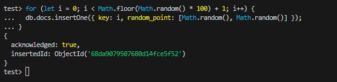

# ДЗ 1

ФИО: Демухаметов Павел

## Окружение
- Windows 11 + Docker
- Образ: mongo:8.0.14

## Развёртывание в docker

### Создание сети
~~~powershell
docker network create mongo-net
~~~

### Развёртывание
~~~powershell
docker run -d `
  --name mongo `
  --network mongo-net `
  --restart unless-stopped `
  -v "D:/mongo8:/data/db" `
  -e MONGO_INITDB_ROOT_USERNAME=root `
  -e MONGO_INITDB_ROOT_PASSWORD=Admin123 `
  mongo:latest
~~~

## Подключение
~~~powershell
docker run -it --rm --name mongo-client --network mongo-net mongo:latest sh -lc "HOME=/tmp mongosh --host mongo -u root -p Admin123 --authenticationDatabase admin"
~~~

## Создание коллекции со случайным количеством элементов 
~~~javascript
use test
for (let i = 0; i < Math.floor(Math.random() * 100) + 1; i++) {
  db.docs.insertOne({ key: i, random_point: [Math.random(), Math.random()] });
}
~~~

## Просмотр количества элементов
~~~javascript
    db.docs.countDocuments();
~~~

## Просмотр документов
~~~javascript
db.docs.find().toArray()
[
  {
    _id: ObjectId('68da9078507680d14fce5f47'),
    key: 0,
    random_point: [ 0.6786239276118811, 0.47601955232780035 ]
  },
  {
    _id: ObjectId('68da9079507680d14fce5f48'),
    key: 1,
    random_point: [ 0.965790960998461, 0.4601131399189595 ]
  },
  {
    _id: ObjectId('68da9079507680d14fce5f49'),
    key: 2,
    random_point: [ 0.34388522768717644, 0.4999778666685486 ]
  },
  {
    _id: ObjectId('68da9079507680d14fce5f4a'),
    key: 3,
    random_point: [ 0.049244711335179714, 0.28031238001852987 ]
  },
  {
    _id: ObjectId('68da9079507680d14fce5f4b'),
    key: 4,
    random_point: [ 0.14570290259449292, 0.8794064736791363 ]
  },
  {
    _id: ObjectId('68da9079507680d14fce5f4c'),
    key: 5,
    random_point: [ 0.11625281862245185, 0.23807937597482343 ]
  },
  {
    _id: ObjectId('68da9079507680d14fce5f4d'),
    key: 6,
    random_point: [ 0.6074612561169117, 0.5133587000092754 ]
  },
  {
    _id: ObjectId('68da9079507680d14fce5f4e'),
    key: 7,
    random_point: [ 0.5200711262634095, 0.4387946409646333 ]
  },
  {
    _id: ObjectId('68da9079507680d14fce5f4f'),
    key: 8,
    random_point: [ 0.06157670858902797, 0.4211115563884378 ]
  },
  {
    _id: ObjectId('68da9079507680d14fce5f50'),
    key: 9,
    random_point: [ 0.6324438570352453, 0.5122070841888644 ]
  },
  {
    _id: ObjectId('68da9079507680d14fce5f51'),
    key: 10,
    random_point: [ 0.7356257609972414, 0.7693127855231205 ]
  },
  {
    _id: ObjectId('68da9079507680d14fce5f52'),
    key: 11,
    random_point: [ 0.8429547547490168, 0.07591201751450516 ]
  }
]
~~~
