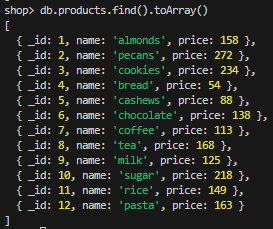
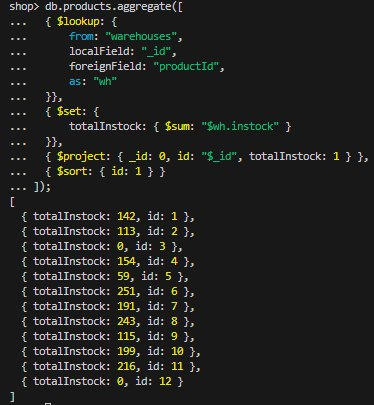

# ДЗ 2

ФИО: Демухаметов Павел

## Окружение
- Windows 11 + Docker
- Образ: mongo:8.0.14

---

## Схема данных
- products: { _id, name, price }
- warehouses: { _id, productId, warehouse, instock }
- Связь: warehouses.productId = products._id

---

## Генерация данных

~~~javascript
use shop;

// Функция случайного числа в диапозоне 
function rnd(min, max) { return Math.floor(Math.random() * (max - min + 1)) + min; }

// Массив названий товаров
let items = [
  "almonds","pecans","cookies","bread","cashews","chocolate",
  "coffee","tea","milk","sugar","rice","pasta"
];

// Создание товаров по всем названиям
for (let i = 1; i <= items.length; i++) {
  db.products.insertOne({
    _id: i,
    name: items[i - 1],
    price: rnd(10, 300)
  });
}

// Создание случайного склада со случаным количеством товаров 
let codes = ["A","B","C"];
for (let wid = 1, limit = rnd(10, 20); wid <= limit; wid++) {
  db.warehouses.insertOne({
    _id: wid,
    productId: rnd(1, items.length),
    warehouse: codes[rnd(0, codes.length - 1)],
    instock: rnd(0, 200)
  });
}
~~~

### Скрин значений в products

### Скрин значений в warehouses

## Aggregation framework
~~~javascript
db.products.aggregate([
  { $lookup: {
      from: "warehouses",
      localField: "_id",
      foreignField: "productId",
      as: "wh"
  }},
  { $set: {
      totalInstock: { $sum: "$wh.instock" }
  }},
  { $project: { _id: 0, id: "$_id", totalInstock: 1 } },
  { $sort: { id: 1 } }
]);
~~~
### Скрин результата

## Map Reduce
~~~javascript

// Получаем id и количество товара
function mapStock() {
  if (this.productId != null) emit(this.productId, this.instock);
}
// Сумма количества товаров по id
function reduceStock(key, values) {
  return Array.sum(values);
}

db.warehouses.mapReduce(mapStock, reduceStock, { out: { replace: "totals_by_product" } });

db.totals_by_product.find().sort({ _id: 1 });
~~~
### Скрин результата
