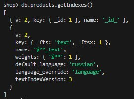

# ДЗ 3

ФИО: Демухаметов Павел

## Окружение
- Windows 11 + Docker
- Образ: mongo:8.0.14

---

## Схема данных
products:
- _id: Number
- name: String
- price: Number
- tags: [String]
- description: String
- specs: {
  color: String,
  material: String,
  ram: String,
  storage: String,
  withOS: Boolean
}

---

## Генерация данных

~~~javascript
use shop;

function rnd(min, max) { return Math.floor(Math.random() * (max - min + 1)) + min; }
function pick(arr) { return arr[rnd(0, arr.length - 1)]; }
function pickMany(arr, min = 1, max = 3) {
  const k = Math.min(arr.length, rnd(min, max));
  const s = new Set();
  while (s.size < k) s.add(pick(arr));
  return [...s];
}

const names = Array.from({ length: 20 }, (_, i) => `Laptop ${i + 1}`);
const colors = ["черный", "белый", "серый", "синий", "фиолетовый"];
const tagsPool = ["bluetooth", "игровой", "дом", "офис", "портативный", "тихий", "GeForce RTX 4070"];
const descParts = ["компактный", "мощный", "тихий", "умный", "игровой", "портативный"];
const sentences = ["поддерживает bluetooth", "для дома и офиса", "Type-C", "без ОС", "Windows 11 Home Single Language"];

function makeSpecs() {
  return {
    color: pick(colors),
    material: pick(["Металл", "Пластик", "Нанотрубки"]),
    ram: pick(["8GB", "16GB"]),
    storage: pick(["256GB", "512GB"]),
    withOS: pick([true, false]),
  };
}

for (let i = 1; i <= names.length; i++) {
  const name = names[i - 1];
  db.products.insertOne({
    _id: i,
    name,
    price: rnd(30000, 300000),
    tags: pickMany(tagsPool, 2, 4),
    description: `${pick(descParts)}, ${pick(descParts)}. ${name} ${pick(sentences)}.`,
    specs: makeSpecs()
  });
}
~~~

## Wildcard text index
~~~javascript
// default_language: "russian" позволяет использовать русские стемминг и стоп-слова
db.products.createIndex(
  { "$**": "text" },
  {  default_language: "russian", language_override: "language" }
);
db.products.getIndexes()
~~~
### Скрин существующих индексов. Один по умолчанию по id, второй созданный wildcard text index

## План запроса при неработающем индексе
~~~javascript
// Будет COLLSCAN потому, что равенство по полю name не использует Wildcard text index 
db.products.explain("executionStats").find({ name: "Laptop 7" });

{
  explainVersion: '1',
  queryPlanner: {
    namespace: 'shop.products',
    parsedQuery: { name: { '$eq': 'Laptop 7' } },
    indexFilterSet: false,
    queryHash: '544F3E5C',
    planCacheShapeHash: '544F3E5C',
    planCacheKey: 'B9363AF4',
    optimizationTimeMillis: 9,
    maxIndexedOrSolutionsReached: false,
    maxIndexedAndSolutionsReached: false,
    maxScansToExplodeReached: false,
    prunedSimilarIndexes: false,
    winningPlan: {
      isCached: false,
      stage: 'COLLSCAN', // Полный скан 
      filter: { name: { '$eq': 'Laptop 7' } },
      direction: 'forward'
    },
    rejectedPlans: []
  },
  executionStats: {
    executionSuccess: true,
    nReturned: 1, // сколько документов найдено
    executionTimeMillis: 11, // время запроса
    totalKeysExamined: 0,
    totalDocsExamined: 20, // документов прочитано
    executionStages: {
      isCached: false,
      stage: 'COLLSCAN',
      filter: { name: { '$eq': 'Laptop 7' } },
      nReturned: 1,
      executionTimeMillisEstimate: 0,
      works: 21,
      advanced: 1,
      needTime: 19,
      needYield: 0,
      saveState: 0,
      restoreState: 0,
      isEOF: 1,
      direction: 'forward',
      docsExamined: 20
    }
  },
  queryShapeHash: '9B235DC461A5263E4CE00BECC5707409A352A2FAD91A68007B5CC44E3A33E9F6',
  command: { find: 'products', filter: { name: 'Laptop 7' }, '$db': 'shop' },
  serverInfo: {
    host: '2ca56810d5f1',
    port: 27017,
    version: '8.0.14',
    gitVersion: 'bbdb887c2ac94424af0ee8fcaad39203bdf98671'
  },
  serverParameters: {
    internalQueryFacetBufferSizeBytes: 104857600,
    internalQueryFacetMaxOutputDocSizeBytes: 104857600,
    internalLookupStageIntermediateDocumentMaxSizeBytes: 104857600,
    internalDocumentSourceGroupMaxMemoryBytes: 104857600,
    internalQueryMaxBlockingSortMemoryUsageBytes: 104857600,
    internalQueryProhibitBlockingMergeOnMongoS: 0,
    internalQueryMaxAddToSetBytes: 104857600,
    internalDocumentSourceSetWindowFieldsMaxMemoryBytes: 104857600,
    internalQueryFrameworkControl: 'trySbeRestricted',
    internalQueryPlannerIgnoreIndexWithCollationForRegex: 1
  },
  ok: 1
}
~~~

## План запроса при работающем индексе
~~~javascript
// Wildcard text index ищет по всем строковым полям вхождение текста
db.products.find(
  { $text: { $search: "мощный, умный" } }
).explain("executionStats");

{
  explainVersion: '1',
  queryPlanner: {
    namespace: 'shop.products',
    parsedQuery: {
      '$text': {
        '$search': 'мощный, умный',
        '$language': 'russian',
        '$caseSensitive': false,
        '$diacriticSensitive': false
      }
    },
    indexFilterSet: false,
    queryHash: 'CF6F4CEE',
    planCacheShapeHash: 'CF6F4CEE',
    planCacheKey: '08852285',
    optimizationTimeMillis: 7,
    maxIndexedOrSolutionsReached: false,
    maxIndexedAndSolutionsReached: false,
    maxScansToExplodeReached: false,
    prunedSimilarIndexes: false,
    winningPlan: {
      isCached: false,
      stage: 'TEXT_MATCH', // Текстовый индекс
      indexPrefix: {},
      indexName: '$**_text', // Имя индекса
      parsedTextQuery: {
        terms: [ 'мощн', 'умн' ], // стеммы слов поиска
        negatedTerms: [],
        phrases: [],
        negatedPhrases: []
      },
      textIndexVersion: 3,
      inputStage: {
        stage: 'FETCH',
        inputStage: {
          stage: 'OR',
          inputStages: [
            {
              stage: 'IXSCAN',
              keyPattern: { _fts: 'text', _ftsx: 1 },
              indexName: '$**_text',
              isMultiKey: true,
              isUnique: false,
              isSparse: false,
              isPartial: false,
              indexVersion: 2,
              direction: 'backward',
              indexBounds: {}
            },
            {
              stage: 'IXSCAN',
              keyPattern: { _fts: 'text', _ftsx: 1 },
              indexName: '$**_text',
              isMultiKey: true,
              isUnique: false,
              isSparse: false,
              isPartial: false,
              indexVersion: 2,
              direction: 'backward',
              indexBounds: {}
            }
          ]
        }
      }
    },
    rejectedPlans: []
  },
  executionStats: {
    executionSuccess: true,
    nReturned: 11,  // сколько документов найдено
    executionTimeMillis: 9, // время запроса
    totalKeysExamined: 12, // количество просмотренных ключей индекса
    totalDocsExamined: 11, // сколько документов просмотрено 
    executionStages: {
      isCached: false,
      stage: 'TEXT_MATCH',
      nReturned: 11,
      executionTimeMillisEstimate: 0,
      works: 14,
      advanced: 11,
      needTime: 2,
      needYield: 0,
      saveState: 0,
      restoreState: 0,
      isEOF: 1,
      indexPrefix: {},
      indexName: '$**_text',
      parsedTextQuery: {
        terms: [ 'мощн', 'умн' ],
        negatedTerms: [],
        phrases: [],
        negatedPhrases: []
      },
      textIndexVersion: 3,
      docsRejected: 0,
      inputStage: {
        stage: 'FETCH',
        nReturned: 11,
        executionTimeMillisEstimate: 0,
        works: 14,
        advanced: 11,
        needTime: 2,
        needYield: 0,
        saveState: 0,
        restoreState: 0,
        isEOF: 1,
        docsExamined: 11,
        alreadyHasObj: 0,
        inputStage: {
          stage: 'OR',
          nReturned: 11,
          executionTimeMillisEstimate: 0,
          works: 14,
          advanced: 11,
          needTime: 2,
          needYield: 0,
          saveState: 0,
          restoreState: 0,
          isEOF: 1,
          dupsTested: 12,
          dupsDropped: 1,
          inputStages: [
            {
              stage: 'IXSCAN',
              nReturned: 10,
              executionTimeMillisEstimate: 0,
              works: 11,
              advanced: 10,
              needTime: 0,
              needYield: 0,
              saveState: 0,
              restoreState: 0,
              isEOF: 1,
              keyPattern: { _fts: 'text', _ftsx: 1 },
              indexName: '$**_text',
              isMultiKey: true,
              isUnique: false,
              isSparse: false,
              isPartial: false,
              indexVersion: 2,
              direction: 'backward',
              indexBounds: {},
              keysExamined: 10,
              seeks: 1,
              dupsTested: 10,
              dupsDropped: 0
            },
            {
              stage: 'IXSCAN',
              nReturned: 2,
              executionTimeMillisEstimate: 0,
              works: 3,
              advanced: 2,
              needTime: 0,
              needYield: 0,
              saveState: 0,
              restoreState: 0,
              isEOF: 1,
              keyPattern: { _fts: 'text', _ftsx: 1 },
              indexName: '$**_text',
              isMultiKey: true,
              isUnique: false,
              isSparse: false,
              isPartial: false,
              indexVersion: 2,
              direction: 'backward',
              indexBounds: {},
              keysExamined: 2,
              seeks: 1,
              dupsTested: 2,
              dupsDropped: 0
            }
          ]
        }
      }
    }
  },
  queryShapeHash: '660EF240A2D1D29281DA818C4D57533FF57900006B0792A05202FF7A7465181D',
  command: {
    find: 'products',
    filter: { '$text': { '$search': 'мощный, умный' } },
    '$db': 'shop'
  },
  serverInfo: {
    host: '2ca56810d5f1',
    port: 27017,
    version: '8.0.14',
    gitVersion: 'bbdb887c2ac94424af0ee8fcaad39203bdf98671'
  },
  serverParameters: {
    internalQueryFacetBufferSizeBytes: 104857600,
    internalQueryFacetMaxOutputDocSizeBytes: 104857600,
    internalLookupStageIntermediateDocumentMaxSizeBytes: 104857600,
    internalDocumentSourceGroupMaxMemoryBytes: 104857600,
    internalQueryMaxBlockingSortMemoryUsageBytes: 104857600,
    internalQueryProhibitBlockingMergeOnMongoS: 0,
    internalQueryMaxAddToSetBytes: 104857600,
    internalDocumentSourceSetWindowFieldsMaxMemoryBytes: 104857600,
    internalQueryFrameworkControl: 'trySbeRestricted',
    internalQueryPlannerIgnoreIndexWithCollationForRegex: 1
  },
  ok: 1
}
~~~
